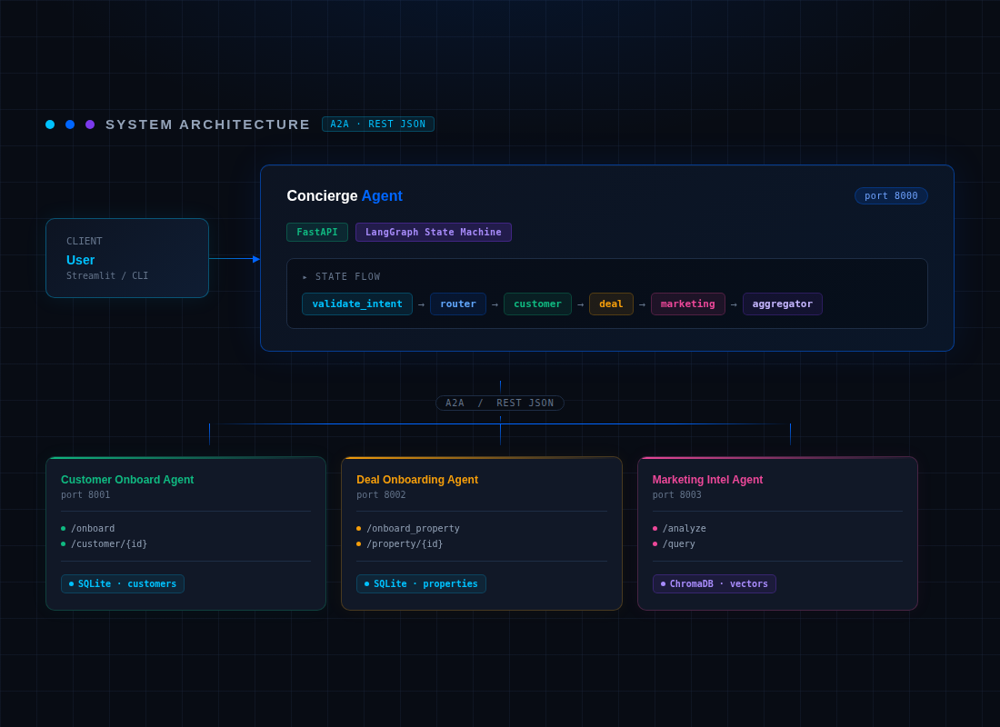

# 🏠 Federated Multi‑Agent Real Estate System
### Agent‑to‑Agent (A2A) Protocol · LangGraph Orchestration · RAG · Streamlit UI

A fully local, open‑source demonstration of a **federated multi‑agent system** for a real estate platform.  
A central **Concierge Agent** discovers specialised agents via their **Agent Cards**, orchestrates
multi‑step workflows, and aggregates responses. The system uses **LangGraph** for stateful
orchestration, **ChromaDB** for vector storage (RAG), **SQLite** for persistence, and **Ollama**
for local LLM inference and embeddings.

---

## 📐 Architecture




### How it works (quick tour)

1. **Streamlit UI** sends a user message to the Concierge (`/chat`).
2. The **Concierge** runs a LangGraph workflow:
   - `validate_intent` checks if the request is real‑estate related and what the user wants.
   - `router` picks the right starting node (customer onboarding, RAG query, property lookup).
   - For onboarding, it automatically chains `customer_onboarding` → `deal_onboarding` → `marketing_analysis` → `aggregate`.
3. At each step the Concierge calls the corresponding A2A agent.  
   Agents communicate via a simple JSON envelope:  
   ```json
   { "status": "success" | "error", "data": { ... }, "error": "..." }
   ```
4. The final response is returned to the UI.  
   The workflow state is checkpointed in **SQLite**, so interrupted sessions can be resumed.

---

## 📋 System Capabilities (All Demonstrated)

| Capability                               | How it’s shown                                                                 |
|------------------------------------------|--------------------------------------------------------------------------------|
| Agent discovery & task delegation        | Concierge fetches `/card` at startup; routes requests by task name.            |
| Structured A2A communication             | All inter‑agent calls use the shared JSON schema.                              |
| End‑to‑end workflow orchestration        | LangGraph state machine automatically chains Customer → Deal → Marketing.      |
| Automatic triggering of downstream agents| Marketing Agent is called immediately after property onboarding (no user step).|
| RAG‑based retrieval & response generation| Marketing stores embeddings in ChromaDB; Concierge queries & synthesises.      |
| Persistent storage & checkpointing       | SQLite for customers/properties; ChromaDB for vectors; LangGraph SQLite checkpoints |
| Logging & observability                 | Every agent logs timestamped messages to stdout and `agent.log`.               |
| Smart intent validation                 | A dedicated node filters out unrelated messages and detects incomplete data.    |
| Duplicate handling                      | Customer and property agents return existing records instead of errors; Marketing returns the existing full insight. |
| Friendly error messages                 | When data is missing, the assistant clearly asks for the required fields.       |
| Property & customer lookups             | Follow‑up questions like “What’s the address?” are answered from the database.   |

---

## 🔧 Prerequisites (Windows / Linux / macOS)

- **Python 3.10+** (with `pip`)
- **Ollama** – install from [ollama.com](https://ollama.com)  
  After installation, pull the required models:
  ```bash
  ollama pull llama3.2
  ollama pull nomic-embed-text
  ```
- **Git** (optional, for cloning)

All other dependencies are Python packages (listed in each agent’s `requirements.txt`).

---

## 🚀 Setup & Execution (Step‑by‑Step)

### 1. Clone / Create the Project Directory

Create a root folder (e.g., `realestate-multiagent`) with the following structure:

```
realestate-multiagent/
├── shared/
│   ├── __init__.py
│   ├── a2a_client.py
│   ├── models.py
│   └── logging_config.py
├── customer_agent/
│   ├── __init__.py
│   ├── main.py
│   ├── models.py
│   └── requirements.txt
├── deal_agent/
│   ├── __init__.py
│   ├── main.py
│   ├── models.py
│   └── requirements.txt
├── marketing_agent/
│   ├── __init__.py
│   ├── main.py
│   ├── chroma_store.py
│   └── requirements.txt
├── concierge/
│   ├── __init__.py
│   ├── main.py
│   ├── graph.py
│   ├── streamlit_app.py
│   ├── agent_cards_config.json
│   └── requirements.txt
└── README.md
```

### 2. Install Dependencies

Open a terminal in the **project root** and run:

**Windows** (virtual environment recommended):
```cmd
python -m venv venv
venv\Scripts\activate
pip install -r customer_agent/requirements.txt
pip install -r deal_agent/requirements.txt
pip install -r marketing_agent/requirements.txt
pip install -r concierge/requirements.txt
```

**Linux / macOS**:
```bash
python3 -m venv venv
source venv/bin/activate
pip install -r customer_agent/requirements.txt
pip install -r deal_agent/requirements.txt
pip install -r marketing_agent/requirements.txt
pip install -r concierge/requirements.txt
```

### 3. Set PYTHONPATH (so `shared` package is visible)

From the **project root**:

**Windows (cmd):**
```cmd
set PYTHONPATH=%cd%
```
**Windows (PowerShell):**
```powershell
$env:PYTHONPATH = (Get-Location).Path
```
**Linux / macOS (Bash):**
```bash
export PYTHONPATH=$PWD
```

### 4. Start the Agents (4 terminals)

Always from the **project root**.

| Agent                  | Command                                                        | Port  |
|------------------------|----------------------------------------------------------------|-------|
| **Customer Onboarding** | `uvicorn customer_agent.main:app --port 8001 --reload`        | 8001  |
| **Deal Onboarding**     | `uvicorn deal_agent.main:app --port 8002 --reload`            | 8002  |
| **Marketing Intelligence**| `uvicorn marketing_agent.main:app --port 8003 --reload`      | 8003  |
| **Concierge**           | `uvicorn concierge.main:app --port 8000 --reload`             | 8000  |

Wait until each terminal shows `Application startup complete`.

### 5. Launch the Streamlit UI (recommended for testing)

In a **5th terminal**, from the project root:
```bash
streamlit run concierge/streamlit_app.py --server.port 8501
```
Then open your browser to: **http://localhost:8501**

> The UI sends messages to the Concierge and displays the assistant’s replies.  
> It keeps a session ID (shown in the sidebar) so that LangGraph can resume interrupted workflows.

---

## 🧪 Sample Test Cases

You can test the system either through the **Streamlit UI** or with `curl` commands.  
The Streamlit UI is the easiest way to see all the intelligent behaviour (validation, duplicate handling, friendly errors).

### 1. Onboard a Customer & Property (Core Flow)

**Streamlit UI:**  
Type exactly:

```
Add customer John Doe, email john@example.com, budget 500000. Then add his property 123 Main St, price 450000, 3 bed, 2 bath.
```

You should see a response that includes:  
- Customer onboarded with ID …  
- Property onboarded with ID …  
- A full **Market Intelligence Report** with trends, risks, and opportunities.

**Curl (alternative):**
```bash
curl -X POST http://localhost:8000/chat \
  -H "Content-Type: application/json" \
  -d '{
    "message": "Add customer John Doe, email john@example.com, budget 500000. Then add his property 123 Main St, price 450000, 3 bed, 2 bath.",
    "session_id": "test1"
  }'
```

### 2. RAG‑based Market Query

After onboarding, you can ask follow‑up questions about that property.

**Streamlit UI:**  
```
What are the market risks for property <PROPERTY_ID>?
```
(replace `<PROPERTY_ID>` with the actual ID from the onboarding response, or simply rely on the session – the system remembers the last property)

**Curl:**
```bash
curl -X POST http://localhost:8000/chat \
  -H "Content-Type: application/json" \
  -d '{
    "message": "What are the market risks and opportunities for property <PROPERTY_ID>?",
    "session_id": "test2"
  }'
```

### 3. Duplicate Handling

Run the **exact same onboarding message** again. The system will notice that the customer and property already exist and will return the existing records along with the full insight from before.

**Expected (example):**  
> Customer already exists with ID 3f7a… Property already analysed. Here is the existing report: …

### 4. Friendly Error Messages

Test what happens when data is missing.

**Streamlit UI / Curl:**
```
Add a customer
```
The assistant will answer with:
> I need a bit more information to onboard the customer. Please provide the customer's **email** and **budget**, for example: `Add customer Jane Doe, email jane@example.com, budget 350000.`

Test incomplete property data:
```
Add property 123 Main St
```
The assistant will ask for the price.

### 5. Property & Customer Lookups

After onboarding, you can ask follow‑up questions:

```
What is the address of the property?
```
The system returns the stored address, price, bedrooms, etc.

```
Show customer details
```
Returns the customer information from the database.

### 6. Off‑Topic Rejection

Try a non‑real‑estate message:
```
What is the weather like?
```
The assistant will politely decline:
> I'm a real‑estate assistant. Please ask me about properties, customers, or market insights.

---

## 🧰 Tech Stack

| Component          | Technology / Library                | Notes                                    |
|--------------------|-------------------------------------|------------------------------------------|
| Orchestration      | **LangGraph** (StateGraph)          | Manages the multi‑step workflow          |
| Protocol           | **A2A** (JSON over REST)            | Agents describe themselves via `/card`   |
| Backend Framework  | **FastAPI**                         | Each agent is a standalone FastAPI app   |
| LLM                | **Ollama** – `llama3.2` (3B)        | Runs entirely locally                    |
| Embeddings         | **Ollama** – `nomic-embed-text`     | Local embedding model                    |
| Vector Database    | **ChromaDB** (persistent)           | Stores and retrieves insight chunks      |
| Persistence        | **SQLite**                          | Customer and property data               |
| Checkpointing      | **SQLite** (LangGraph saver)        | Resumable workflows                      |
| Front‑end / Testing| **Streamlit**                       | Interactive chat UI                      |
| Language           | Python 3.10+                        |                                          |

---

## 🔍 Observability & Logging

Every agent writes structured logs to **stdout** and to a file `agent.log` (created in the project root).  
Example log output:

```
2026-04-25 12:00:01 - CustomerAgent - INFO - Onboarded customer 3f7a... (John Doe, john@example.com)
2026-04-25 12:00:02 - DealAgent - INFO - Onboarded property a1b2... (123 Main St)
2026-04-25 12:00:05 - MarketingAgent - INFO - Generated insight for property a1b2...
2026-04-25 12:00:05 - Concierge - INFO - Validation passed. Intent: onboard_full_flow
```

---

## 🔄 Checkpointing & Resume

The Concierge uses **LangGraph’s SQLite checkpointer**.  
If you stop the Concierge during a workflow and restart it, sending a request with the same `session_id` will resume from the last successful node.

---

## 💡 Extending the System

The modular design makes it easy to add new agents or capabilities:
1. Create a new agent folder with a FastAPI server.
2. Expose a `/card` endpoint describing its tasks.
3. Add the agent’s URL to `concierge/agent_cards_config.json`.
4. Add new nodes/edges to `concierge/graph.py` to route to the new agent.

No other agent needs to change – the Concierge discovers and routes automatically.

---

## 🤝 Support

If you encounter any issues, check:
- Ollama is running (`ollama list` in terminal).
- All agents are started from the **project root**.
- `PYTHONPATH` is set correctly (or you’re using a virtual environment).
- Windows Firewall has allowed Python/uvicorn to accept connections.
